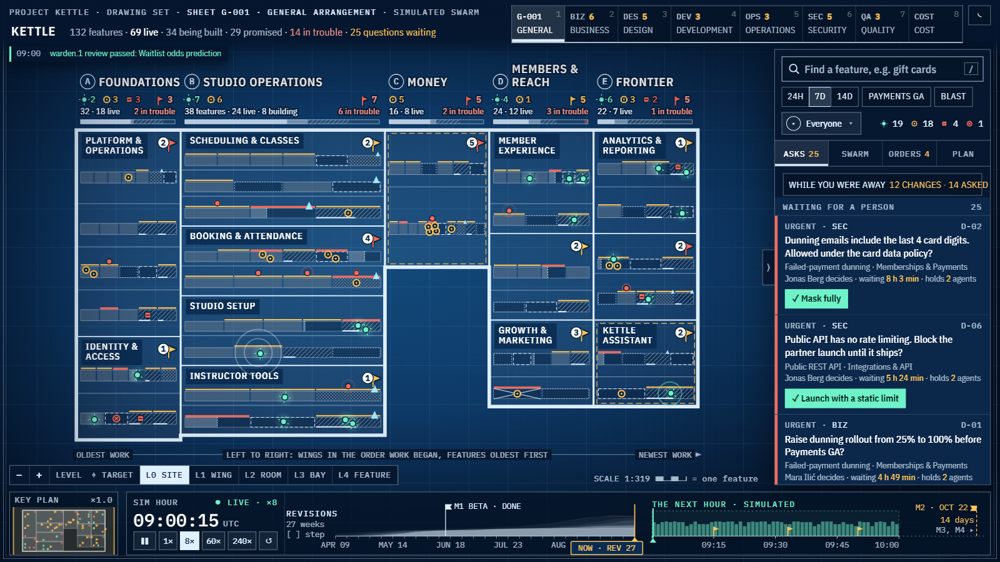
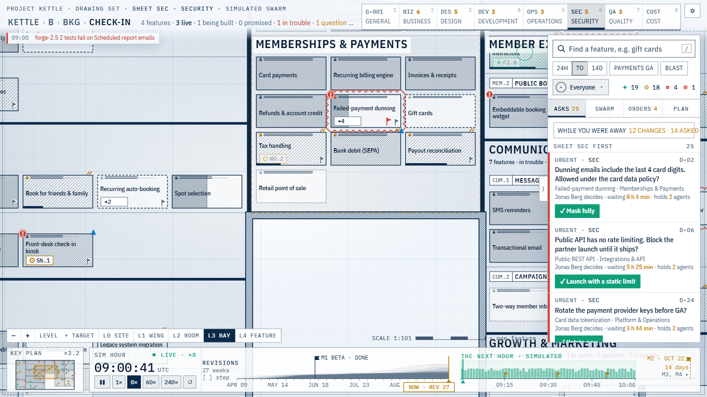

# bp: the product blueprint

A canvas that draws a whole software product as an architect's drawing set: domains as wings,
capabilities as rooms, and features as fixtures. Stage and health are readable at any zoom, and each
person reads the plan through their own lens. On top of the plan, a simulated swarm of AI agents
builds the product. People watch the swarm, answer its questions where they arise, and steer it.

This is the standalone home of the blueprint. Integrations with Personas and other apps will take
subsets of it later. **Status: a working prototype. The design and the product are far from final.**




All data is sample data (a fictional product, *Kettle*, with 132 features), and the swarm is a
simulation.

## Run it

```sh
npm install
npm run dev            # http://localhost:3000
npm run build && npm start
```

| Route | What |
|---|---|
| `/` | The blueprint, with the adopted *subtle* lens expression |
| `/variants` | The three lens expressions (subtle, shaped, bold) for comparison |
| `?theme=light` | The light theme (a toggle in the header too) |
| `?scale=4` | Four product lines, 528 features: the scale test |
| `?lenses=-security,+com.kettle.cost` | Switch lenses off or on for the session |

Keys: `/` search · `1`–`9` lenses (1 = General) · `+` `−` zoom · arrows walk rooms · Enter opens · Esc goes back.

## What is where

```
src/app/              routes: / (blueprint), /variants, /v/[variant]
src/engine/           canvas engine: camera, frame loop, levels of detail, cached plan raster, lens mix
src/components/       React UI around the canvas (header, dock, queue, feature sheet, legend, phone view)
src/variants/         lens expressions: subtle (adopted), shaped, bold
src/lib/standard/     app-structure v3: types, loader, health-rule evaluator, built-in lens catalog
src/lib/model/        derived model: layout, aggregates, search, swarm simulation
src/data/             fixtures: kettle.app-structure.json + kettle.events.jsonl (the product, v3),
                      swarm.json (the simulated swarm), kettle.json (the original sample)
docs/blueprint-ui.md          the UI contract: levels, 12 px text floor, performance rules, lenses as data
docs/standard/                app-structure v3: spec, analysis, JSON Schemas, lens manifests, Personas brief
docs/research/users.md        the user analysis: eight people, eleven moments of use
docs/contest-history.md       how the design was chosen, with the owner's verbatim verdicts
docs/fixtures/kettle-sample.md  field reference for the original sample
prototypes/           the two static HTML contest winners the app descends from
scripts/              fixture generators, v3 conversion, validator, perf and screenshot probes
```

## Data: app-structure v3

The app reads one file per product: `src/data/kettle.app-structure.json`, plus an append-only events
log. The format is a superset of Personas' `context-map.json` v2. It adds a product tree, features
with a lifecycle stage, milestones and KPIs. **Lenses are plugins:** each one is a manifest with
fields, health rules written as JSON (no code runs), and presentation hints. A project can add its
own lens or switch any lens off. The spec is `docs/standard/app-structure-v3.md`.

```sh
npm run data:kettle-v3                 # rebuild the v3 map + events from src/data/kettle.json
npm run validate:structure -- src/data/kettle.app-structure.json --events src/data/kettle.events.jsonl
npm run check:lens-health              # built-in lens rules vs the sample's stored health (132/132)
node scripts/fixtures/gen-kettle.mjs <dir>   # regenerate the original sample (deterministic)
node scripts/fixtures/gen-swarm.mjs <dir>    # regenerate the swarm over it
```

## Checks

`npm run typecheck` · `npm run build` · `python scripts/perf.py` (frame times while zooming at
`?scale=4`; the budget is 60 fps, see `docs/perf.md`) · `python scripts/shots.py` (screenshots).
The Python probes need Playwright for Python and a running server.

Stack: Next.js 16, React 19, Motion, TypeScript, and a canvas renderer with no other runtime
dependencies.
